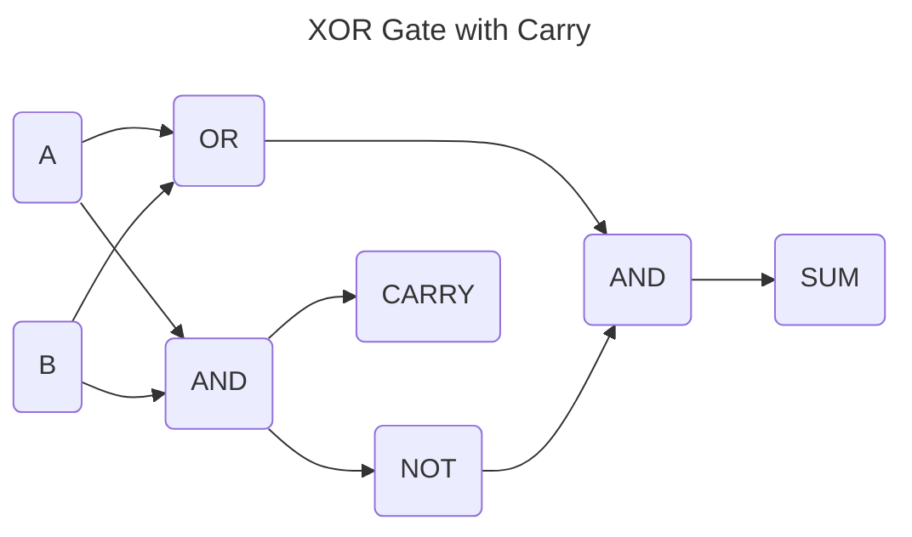

# Part 1

[Book](https://ubuntourist.codeberg.page/Altair-8800/part-1.html#b-electronic-logic)

**Table of Contents**
1. [Introduction](#Intoduction)
2. [Logic](#Logic)
3. [Electronic Logic](#Electronic-Logic)
4. [Number Systems](#Number-Systems)
5. [The Binary System](#The-Binary-System)

## Introduction
 - The Altair 8800 uses the Intel 8080 Chip.
 - The manual is designed to be approachable to begginers and prepare anyone to use the Altair 8800.

## Logic
 - Logic can be repersented with mathematics.
 - Digital computing is founded upon the idea of mathematical logic established by George Boole.
 - Boole's system of logic is based on the idea that a statement is either true or false.
 - The three basic logic statements, or gates, are AND, OR, & NOT.
 - The truth tables for each of these are below.

 **AND**
 | A | B | Out |
 |---|---|-----|
 | 0 | 0 |  0  |
 | 0 | 1 |  0  |
 | 1 | 0 |  0  |
 | 1 | 1 |  1  |

 **OR**
 | A | B | Out |
 |---|---|-----|
 | 0 | 0 |  0  |
 | 0 | 1 |  1  |
 | 1 | 0 |  1  |
 | 1 | 1 |  1  |

 **NOT**
 | A | Out |
 |---|-----|
 | 0 |  1  |
 | 1 |  0  |

## Electonic Logic
 - These logic gates are implemented with transistors, a type of electronic switch.
 - These gates can be combined to create the composite gates NAND & NOR which are the negation of AND & OR respectively.
 - Each gate has a symbol to represent it.
 - When a gate's symbol has a circle at the end of it, it indicates that the gate is negated (NOT, NOR, or NAND).
 - These gates can be combined to create even more comples behavior like the XOR gate.

| A | B | CARRY | SUM | RESULT |
|---|---|-------|-----|--------|
| 0 | 0 |   0   |  0  |   00   |
| 0 | 1 |   0   |  1  |   01   |
| 1 | 0 |   0   |  1  |   01   |
| 1 | 1 |   1   |  0  |   10   |

> [!NOTE]
> This gate has a simpiler impementation using only NAND gates.

 - The inclusion of the carry output allows XOR gate to act as a rudimentary adder circuit; however, when used as a purely as logic gate the carry output is ignored.
 - These gates can be combined to create more complex behavior, in fact the registers in a computer are composed of various logic gates.
 - Some of types of circuits composed of logic gates are bistable, monostable, & astable.

 [Trostin](https://github.com/bananajoeo7/csc215/blob/main/Notes/AltairManualPart1notes.md)
 [Johan](https://github.com/johan-franco/csc215/blob/main/Notes/AltairManualPart1notes.md)

## Number Systems
 - We are accustomed to base 10 number systems.
 - When dealing with computers numbers are often represented in base 2, 8, or 16.
 - This system is useful because do a better job of representing the underlying binary system of computers.
 - Base 8, or octal, values are typicalling indicated with an 0o prefix, e.x. the decimal number 10 in octal would be written as $0o12$.
 - Base 2 would be prefaced by $0b$, and Base 16 with $0x$.
 - The digits in hexadecimal are, in order, 0, 1, 2, 3, 4, 5, 6, 7, 8, 9, a, b, c, d, e, f.

## The Binary System
- Binary is used at the hardware level because it represents the true/false values in electronic logic.
- As in decimal the positon of digits corresponds to their value where each place is equivalent the base to the power of its place times the value at that place.
