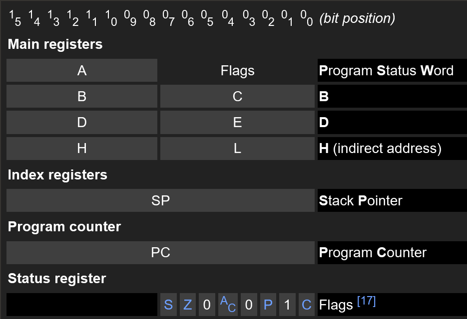
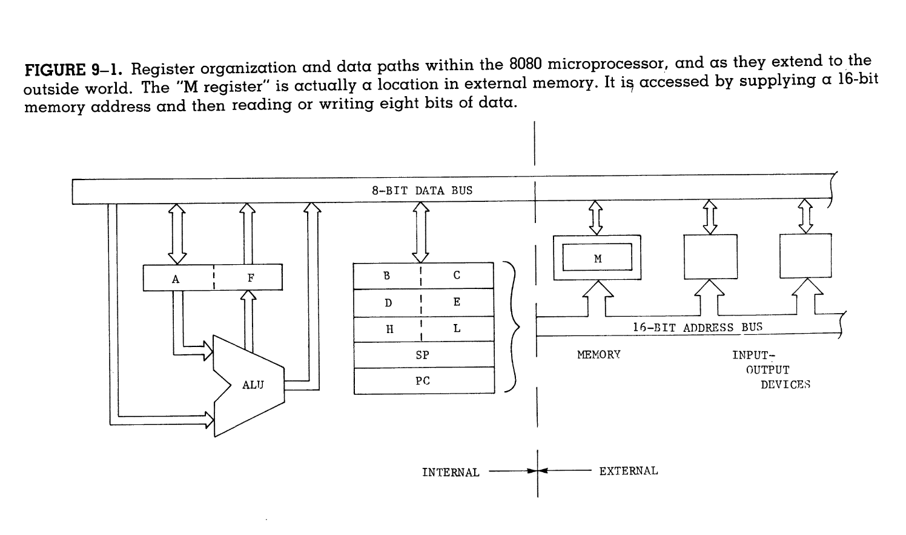
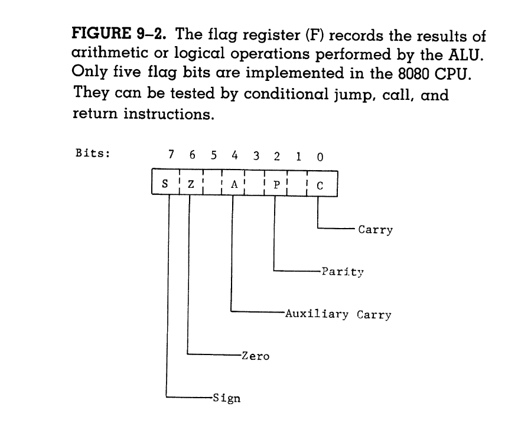

# Register Usage In the 8080
### Anar & Caleb

### Why do we use registers?
1. **Speed**: Because registers are built into the hardware of the CPU they are signifigantly faster than memory.
2. **Portability**: The same registers are availabe on every 8080 chip, whereas memory addresses are more volataile.
3. **Multiple Indexes**: Using multiple registers allows us to store several memory addresses simultaneously.

## Register Organization & Data Paths
Data flows between registers, into the ALU ([Arithmetic Logic Unit](https://en.wikipedia.org/wiki/Arithmetic_logic_unit)), and out to the rest of the world. 

### The ALU
The ALU interacts with the accumulator, the `A` register, and any of the other general purpose registers via the CPU's data bus. Additonally, the ALU can set some of the status bits, e.g. the status bit. Generally results of operations using the ALU will output into the `A` register.

### General Purpose Registers
The three general purpose register pairs, can be combined to form 16-bit registers that can store memory adresses. 

> [!NOTE]
> The link between the `A` and `F` registers is due to there role in the `PUSH` and `POP` stack operations.

### Register Addresses
Some instructions have a place for a register address, these addresses are:
| Binary | Decimal | Register |
|--------|---------|----------|
|  000   |    0    |    B     |
|  001   |    1    |    C     |
|  010   |    2    |    D     |
|  011   |    3    |    E     |
|  100   |    4    |    H     | 
|  101   |    5    |    L     |
|  110   |    6    |    M     |
|  111   |    7    |    A     |

## The M Register

The M "register" is not actually a register, but rather the value at the address indicated by the `HL` register pair. This register's utility is often overlooked because of programmer's inability to think in terms of the hardware.
[Anar's Notes](https://github.com/FunnyManAnar/csc215/blob/main/9%20Register%20Usage%20In%20the%208080.md)

## Stack Operations
The stack allows for register state to be saved and recalled using the `PUSH` and `POP` instructions. This feature is especially important because it's how a return address is saved so a subroutine can be exited. Often these pushes are referred to as "pushing onto the top of the stack" and "popping data off the top of the stack" though in reality the stack technically grows downwards, though this doesn't affect what is happening conceptually.

## Register Use by the User & the System
Typically both user programs and the system will try to return 8-bit data through the `A` register because it can be used for generic I/O operations. The system will use the `B` register to store the higher order byte when recieving a 16-bit input or outputting 16-bit data. As users and programmers we should always assume subroutines will destroy your input data. Additionally, if you are passing pointers to a subroutine prioritize the `HL` pair first and then the `DE` pair. If you are writing subroutines, avoid affecting the state of the `B`, `C`, `D`, `E`, `H`, & `L` registers.

> [!IMPORTANT]
> These are not hard and fast rules they are generic guidelines to help avoid some headaches. Don't try to reinvent the wheel.
